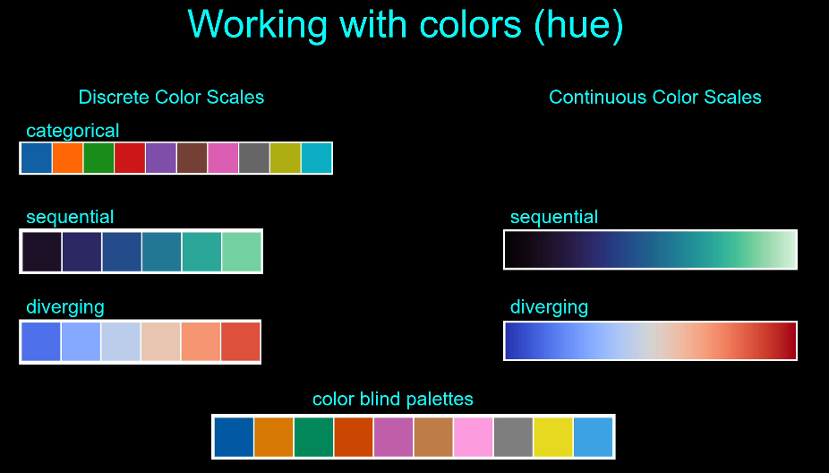

First section provides a list of books that can provide fundamentals of data visualization.

Aestetics 
* position
* shape
* size
* color
* line width
* line type

ways to categorize data
* continuous vs. discrete
* quantitative (numerical) vs. qualitative (categorical)
    * price, weight, height - quantitive
    * hair color, pet, car style - qualitative
* ordered vs unordered in categorical data
    * unordered has not relationship - dog, cat, horse
    * ordered - small, medium, large

Colors, aka hue

Using small mulitple plots, where they all share the same scale and axes allows for comparison of data.  Know as trellis, lattice, grid, panel or facet charts.

Exploratory analysis
* get famaliar with data
* focus on speed
* used to find interesting stuff

Explanatory Analysis
* This is about the audience
* conveys information
* well-crafted

The tools that are useful for the exploratory analysis may not be the best for the explanatory analysis.

