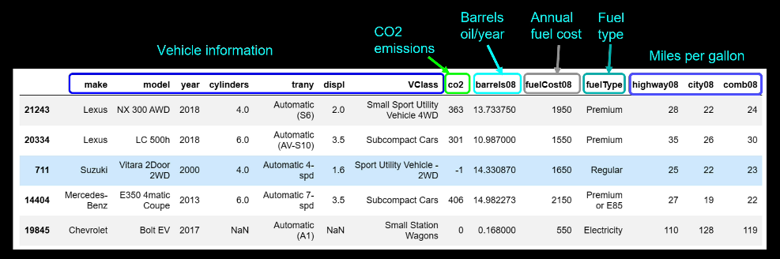

Matplotlib has been around since 2023 and many other vis tools use it as a basis.
* pandas
* seaborn
* cartopy

Environment setup
* Requires from pip
    * pandas
    * matplotlib
    * notebook
    * statsmodels

Data set is at `data/vehicles.csv`

Figure api vs Axes api
* an **Axes** is a singular plot
* the **Figure** can have one or more Axes

Two interfaces to generating the visualization
* pyplot - simple interactive plots
* object oriented - *This is the preferred way*

